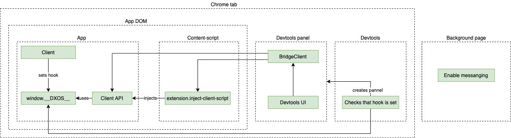

# DevTools

## Instalation

1. Grab a build from the latest release.
1. Unzip it.
1. Enable developer mode in chrome.
1. Load unpacked extension.

## Extension startup sequence

1. SDK sets `window.__DXOS__` hook.
1. Content script is injected into the page automatically by chrome.
    1. Allows messaging with the page
    1. Sets up a RPC handler to inject the client API.
1. Devtools background page is created
    1. Waits for `window.__DXOS__` hook to appear.
    1. Creates devtools panel.
1. Devtools panel is loaded.
    1. Calls content script to inject client API into the page.
    1. Client API connects to the `window.__DXOS__` hook.
    1. Client API sends "ready" message.
1. Devtools pannel is ready.

## Contributing

PRs accepted.

## License

GPL-3.0 © DXOS.org

